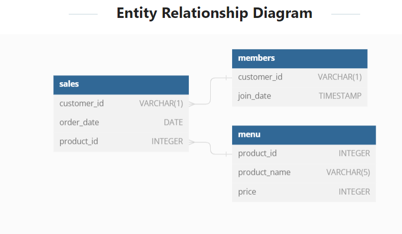

# Case Study #1 - Danny's Diner


## Table of contents
- [Introduction](#introduction)
- [Business Task](#business-task)
- [Dataset](#dataset)
- [Entity Relationship Diagram](#entity-relationship-diagram)
- [Questions and Solutions](#questions-and-solutions)

This case study is available on the challenge [website](https://8weeksqlchallenge.com/case-study-1/).

<a id="introduction"></a>
## **INTRODUCTION**

Danny seriously loves Japanese food so in the beginning of 2021, he decides to embark upon a risky venture and opens up a cute little restaurant that sells his 3 favorite foods: sushi, curry and ramen.

<a id="business-task"></a>
## **BUSINESS TASK**

Danny wants to use the data to answer a few simple questions about his customers, especially about their visiting patterns, how much money they’ve spent and also which menu items are their favorite. 

<a id="dataset"></a>
## DATASET 
There are 3 key datasets for this case study:

**```sales```** 
<details> 
<summary> 
View table 
</summary>

The sales table captures all ```customer_id``` level purchases with an corresponding ```order_date``` and ```product_id``` information for when and what menu items were ordered.

|customer_id|order_date|product_id|
|-----------|----------|----------|
|A          |2021-01-01|1         |
|A          |2021-01-01|2         |
|A          |2021-01-07|2         |
|A          |2021-01-10|3         |
|A          |2021-01-11|3         |
|A          |2021-01-11|3         |
|B          |2021-01-01|2         |
|B          |2021-01-02|2         |
|B          |2021-01-04|1         |
|B          |2021-01-11|1         |
|B          |2021-01-16|3         |
|B          |2021-02-01|3         |
|C          |2021-01-01|3         |
|C          |2021-01-01|3         |
|C          |2021-01-07|3         |

 </details>


**```menu```**

<details>
<summary>
View table
</summary>

The menu table maps the ```product_id``` to the actual ```product_name``` and price of each menu item.

|product_id |product_name|price     |
|-----------|------------|----------|
|1          |sushi       |10        |
|2          |curry       |15        |
|3          |ramen       |12        |

</details>


**```members```**

<details>
<summary>
View table
</summary>

The final members table captures the ```join_date``` when a ```customer_id``` joined the beta version of the Danny’s Diner loyalty program.

|customer_id|join_date |
|-----------|----------|
|A          |1/7/2021  |
|B          |1/9/2021  |

 </details>

<a id="entity-relationship-diagram"></a>
## ENTITY RELATIONSHIP DIAGRAM



<a id="questions-and-solutions"></a>
## QUESTIONS AND SOLUTIONS

***All of my queries were executed using Microsoft SQL v19.2.***

**Query #1: What is the total amount each customer spent at the restaurant?**

```sql
SELECT 
	sales.customer_id,
	SUM(menu.price) AS total_sales
FROM sales
JOIN menu
ON sales.product_id = menu.product_id
GROUP BY sales.customer_id
ORDER BY sales.customer_id;

```

**Steps:**

- **SELECT** the `customer_id` from the `sales` table and the `price` from the `menu` table.
- Use **JOIN** to merge `sales` table with the `menu` table based on the `product_id` column.
- Use **SUM** to calculate the total sales for each customer.
- Group the data by `customer_id`.
- Order the results by `customer_id` to make them easier to read.

**Answer:**

| customer_id | total_sales |
| ----------- | ----------- |
| A           | 76          |
| B           | 74          |
| C           | 36          |

---

**Query #2: How many days has each customer visited the restaurant?**

```sql
SELECT
sales.customer_id,
COUNT (DISTINCT(order_date)) AS number_of_visit
FROM sales
GROUP BY customer_id
ORDER BY customer_id;
```

**Steps:** 

- **SELECT** the `customer_id` from the `sales` table.
- Use **COUNT** function to calculate the number of  order dates for each customer. Using **DISTINCT** ensures that each date is counted only once per customer.
- Group the data by `customer_id`.
- Order the results by `customer_id`.

**Answer:** 

| customer_id | number_of_visit | 
| ----------- | --------------- | 
| A           | 4               |
| B           | 6               |
| C           | 2               |

---

**Query #3: What was the first item from the menu purchased by each customer?** 

```sql
WITH t1 AS
(
SELECT
sales.customer_id,
sales.order_date,
menu.product_name,
DENSE_RANK () OVER (PARTITION BY sales.customer_id ORDER BY sales.order_date) AS date_rank
FROM sales
JOIN menu
ON sales.product_id = menu.product_id
)

SELECT
customer_id,
product_name
FROM t1
WHERE date_rank = 1
```   
       
**Steps:** 

- Create a Common Table Expression (CTE) named `t1` to gather information about each customer's first purchase date and the corresponding product.
- In the CTE:
    - **SELECT** the following columns in the CTE:
        - `customer_id`, `order_date`, `product_name`
        - Use the **DENSE_RANK** window function to assign a ranking to each purchase date within each customer group. The **PARTITION BY** clause ****partitions the data by `customer_id`, and the **ORDER BY** clause puts the `order_date` in order within each partition.
    - Use **JOIN** to merge `sales` table with the `menu` table based on the `product_id` column.
    - Group the data by `customer_id` , `product_name`.
- In the outer query:
    - **SELECT** the `customer_id` and `product_name` columns from `t1` where the rank is equal to 1.
    - Use **WHERE** function to ensure that only the first purchase for each customer is returned.

**Answer:** 

| customer_id | product_name | 
| ----------- | ------------ | 
| A           | sushi        |
| A           | curry        |
| B           | curry        |
| C           | ramen        |        
| C           | ramen        |

---

**Query #4: What is the most purchased item on the menu and how many times was it purchased by all customers?**

```sql
SELECT TOP(1)
menu.product_name,
COUNT(sales.product_id) AS most_purchased_item
FROM menu
JOIN sales
ON sales.product_id = menu.product_id
GROUP BY menu.product_name
ORDER BY most_purchased_item DESC
```

**Steps:** 

- Use **SELECT TOP(1)** to specify that only the first row from the result set will be returned. Then **SELECT** the `product_name` from the table `menu`.
- Use **COUNT** to count the occurrences of each `product_id` in the `sales` table.
- Use **JOIN** to merge `sales` table with the `menu` table based on the `product_id` column.
- Group the data by `product_name`.
- Order the results by `product_name` in in descending order.

**Answer:** 
| product_name | most_purchased_item | 
| ------------ | ------------------- | 
| ramen        | 8                   |

---

**Query #5: Which item was the most popular for each customer?**

```sql
WITH t1 AS
(
SELECT
sales.customer_id,
menu.product_name,
COUNT(sales.product_id) AS order_count,
DENSE_RANK () OVER (PARTITION BY sales.customer_id ORDER BY COUNT(sales.product_id) DESC) AS order_rank
FROM menu
JOIN sales
ON sales.product_id = menu.product_id
GROUP BY sales.customer_id, menu.product_name
)

SELECT
customer_id,
product_name,
order_count
FROM t1
WHERE order_rank = 1;
```

**Steps:** 

- Create a CTE named `t1`.
- In the CTE:
    - **SELECT** the following columns:
        - `customer_id`, `product_name`
        - Use **COUNT** to count the occurrences of each `product_id` in the `sales` table.
        - Use the **DENSE_RANK** window function to calculate the ranking of each `sales.customer_id` based on the count of `sales.product_id` in descending order.
    - Use **JOIN** to merge `sales` table with the `menu` table based on the `product_id` column.
    - Group the data by `customer_id` , `product_name`.
- In the outer query:
    - **SELECT** the `customer_id` and `product_name` columns from `t1` where the rank is equal to 1.
    - Use **WHERE** function to ensure that only the rows with the highest order count for each customer is returned.

**Answer:** 

| customer_id | product_name | order_count |
| ----------- | ------------ | ----------- |
| A           | ramen        | 3           |
| B           | sushi        | 2           |
| B           | curry        | 2           |
| B           | ramen        | 2           |
| C           | ramen        | 3           |
---

**Query #6: Which item was purchased first by the customer after they became a member?**

```sql
WITH t1 AS
(
SELECT
members.customer_id,
sales.order_date,
menu.product_name,
DENSE_RANK () OVER (PARTITION BY members.customer_id ORDER BY sales.order_date) AS date_rank
FROM members
JOIN sales
ON members.customer_id = sales.customer_id
JOIN menu
ON sales.product_id = menu.product_id
WHERE sales.order_date > members.join_date
)

SELECT
customer_id,
product_name
FROM t1
WHERE date_rank = 1;
```

**Steps:** 

- Create a CTE named `t1`.
- In the CTE:
    - **SELECT** the following columns:
        - `customer_id`, `order_date`, `product_name`
        - Use the **DENSE_RANK** window function to calculate the ranking. The **PARTITION BY** clause divides the data by `members.customer_id` . The **ORDER BY** clause orders the rows within each `members.customer_id` partition by `sales.order_date`.
    - Use **JOIN** to merge `members` table with the `sales` table based on the `customer_id` column. Next, use **JOIN** to merge `sales` table with the `menu` table based on the `product_id` column.
    - Apply a condition using **WHERE** to include only purchases made after the customer's join date.
- In the outer query:
    - **SELECT** the `customer_id` and `product_name` columns from `t1` where the rank is equal to 1.
    - Use **WHERE** function to include only the first purchase made by each customer after they became a member.

**Answer:** 

| customer_id | product_name | 
| ----------- | ------------ | 
| A           | ramen        | 
| B           | sushi        | 

---

**Query #7: Which item was purchased just before the customer became a member?**

```sql
WITH t1 AS
(
SELECT
members.customer_id,
menu.product_name,
DENSE_RANK () OVER (PARTITION BY members.customer_id ORDER BY sales.order_date DESC) AS date_rank
FROM members
JOIN sales
ON members.customer_id = sales.customer_id
JOIN menu
ON sales.product_id = menu.product_id
WHERE sales.order_date < members.join_date
)

SELECT
customer_id,
product_name
FROM t1
WHERE date_rank = 1;
```

**Steps:** 

- Create a CTE named `t1`.
- In the CTE:
    - **SELECT** the following columns:
        - `customer_id`, `product_name`
        - Use the **DENSE_RANK** window function to calculate the ranking. The **PARTITION BY** clause divides the data by `members.customer_id` . The **ORDER BY** clause orders the rows within each `members.customer_id` partition by `sales.order_date` in descending order.
    - Use **JOIN** to merge `members` table with the `sales` table based on the `customer_id` column. Next, use **JOIN** to merge `sales` table with the `menu` table based on the `product_id` column.
    - Apply a condition using **WHERE** to include only purchases made before the customer's join date.
- In the outer query:
    - **SELECT** the `customer_id` and `product_name` columns from `t1` where the rank is equal to 1.
    - Use **WHERE** function to include only the purchase made by each customer just right before they became a member.

**Answer:** 

| customer_id | product_name | 
| ----------- | ------------ | 
| A           | sushi        | 
| A           | curry        | 
| B           | sushi        | 

---

**Query #8. What is the total items and amount spent for each member before they became a member?**

```sql
SELECT
members.customer_id,
COUNT(sales.product_id) AS total_items,
SUM(menu.price) AS total_sales
FROM members
JOIN sales
ON members.customer_id = sales.customer_id
JOIN menu
ON sales.product_id = menu.product_id
WHERE sales.order_date < members.join_date
GROUP BY members.customer_id;
```

**Steps:** 

- **SELECT** the `customer_id`.
- Use **COUNT** to count the number of items ordered by each customer for each product.
- Use **SUM** to calculate the total sales amount for each customer for each product.

- Use **JOIN** to merge `members` table with the `sales` table based on the `customer_id` column. Next, use **JOIN** to merge `sales` table with the `menu` table based on the `product_id` column.
- Apply a condition using **WHERE** to include only purchases made after the customer's join date.
- Group the data by `customer_id`.

**Answer:** 

| customer_id | total_items | total_sales |
| ----------- | ----------- | ----------- |
| A           | 2           | 25          |
| B           | 3           | 40          |

---

**Query # 9: If each $1 spent equates to 10 points and sushi has a 2x points multiplier - how many points would each customer have?**

```sql
WITH t1 AS
(
SELECT
sales.customer_id,
menu.product_name,
COUNT(sales.product_id) AS total_items,
SUM(menu.price) AS total_sales
FROM sales
JOIN menu
ON menu.product_id = sales.product_id
GROUP BY sales.customer_id, menu.product_name
)

SELECT customer_id,
SUM(CASE
WHEN product_name = 'sushi' THEN total_sales * 20
ELSE total_sales * 10
END) AS total_points
FROM t1
GROUP BY customer_id;
```

**Steps:** 

- Create a CTE named `t1`.
- In the CTE:
    - **SELECT** the following columns:
        - `customer_id`, `product_name`
        - Use **COUNT** to count the number of items ordered by each customer for each product.
        - Use **SUM** to calculate the total sales amount for each customer for each product.
    - Use **JOIN** to merge `sales` table with the `menu` table based on the `product_id` column.
    - Group the data by `customer_id` and `product_name`.
- In the outer query:
    - **SELECT** the following columns:
        - `customer_id`
        - USE **SUM** to calculates the total points earned by each customer.
    - For the **CASE** statement: Calculates the points for each product based on its name.
        - If `product_name` = 'sushi', the points are calculated as the total sales amount multiplied by 20.
        - Otherwise, it's multiplied by 10.
    - Group the data by `customer_id` to aggregate the points for each customer.

**Answer:** 

| customer_id | total_points | 
| ----------- | -----------  | 
| A           | 860          |
| B           | 940          |
| C           | 360          |

---

**Query #10: In the first week after a customer joins the program (including their join date) they earn 2x points on all items, not just sushi - how many points do customer A and B have at the end of January?**

```sql
WITH t1 AS (
SELECT
members.customer_id,
members.join_date,
sales.order_date,
menu.product_name,
COUNT(sales.product_id) AS sales_count,
SUM(menu.price) AS total_sales,
CASE
WHEN sales.order_date BETWEEN members.join_date AND DATEADD(day, 6, members.join_date) THEN SUM(menu.price) * 20
WHEN menu.product_name = 'sushi' THEN SUM(menu.price) * 20
ELSE SUM(menu.price) * 10
END AS points
FROM members
JOIN sales
ON members.customer_id = sales.customer_id
JOIN menu
ON sales.product_id = menu.product_id
GROUP BY members.customer_id, members.join_date, sales.order_date, menu.product_name
)

SELECT
customer_id,
SUM(points) AS total_points
FROM t1
WHERE order_date <= '2021-01-31'
GROUP BY customer_id;
```

**Steps:** 

- Create a CTE named `t1`.
- In the CTE:
    - **SELECT** the following columns:
        - `customer_id`, `join_date`, `order_date`, `product_name`
        - Use **COUNT** to count the number of items ordered by each customer for each product.
        - Use **SUM** to calculate the total sales amount for each customer for each product.
    - For the **CASE** statement: Calculates the points for each product based on the order date and its name.
        - If the order date is within 7 days of the customer's join date, the points are calculated as the total sales amount multiplied by 20.
        - If the `product_name` = 'sushi', the points are calculated as the total sales amount multiplied by 20.
        - Otherwise, it's multiplied by 10.
    - Use **JOIN** to merge `members` table with the `sales` table based on the `customer_id` column. Next, use **JOIN** to merge `sales` table with the `menu` table based on the `product_id` column.
    - Group the data by `customer_id`, `join_date`, `order_date`, `product_name`.
- In the outer query:
    - **SELECT** the following columns:
        - `customer_id`
        - USE **SUM** to calculates the total points earned by each customer.
        - Apply the condition using WHERE function to filter only `order_date` on or before January 31, 2021.
    - Group the data by `customer_id` to aggregate the points for each customer.

**Answer:** 

| customer_id | total_points | 
| ----------- | -----------  | 
| A           | 1370         |
| B           | 820          |
